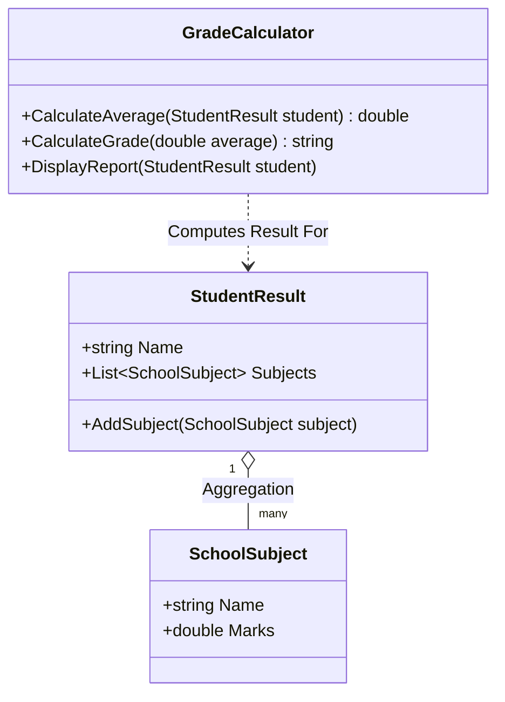
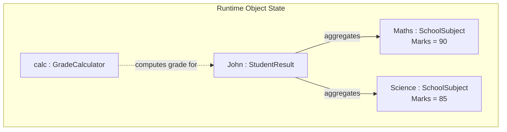
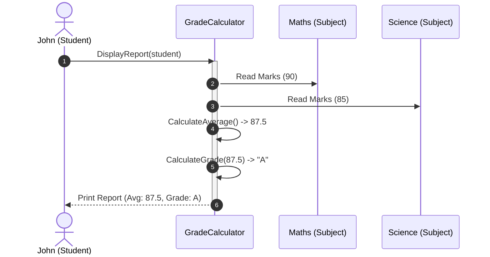
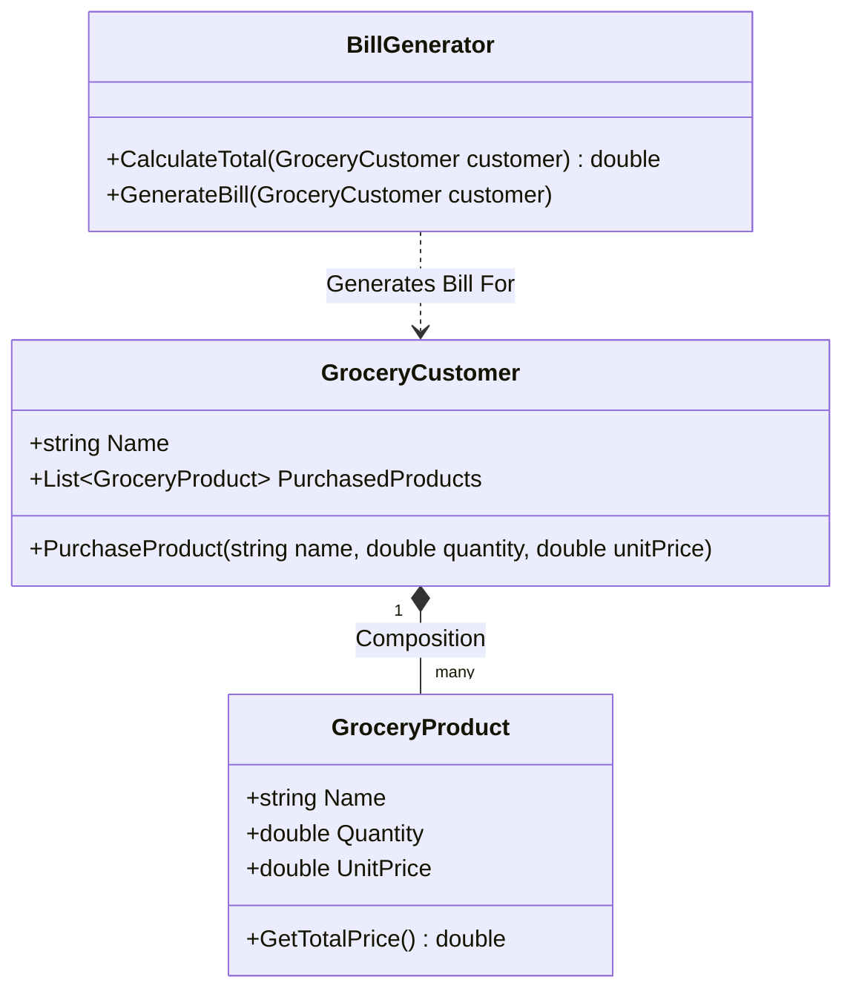
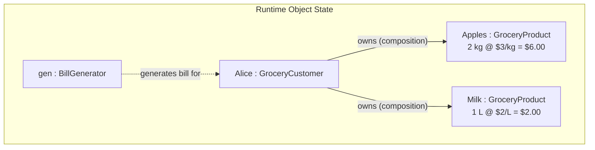
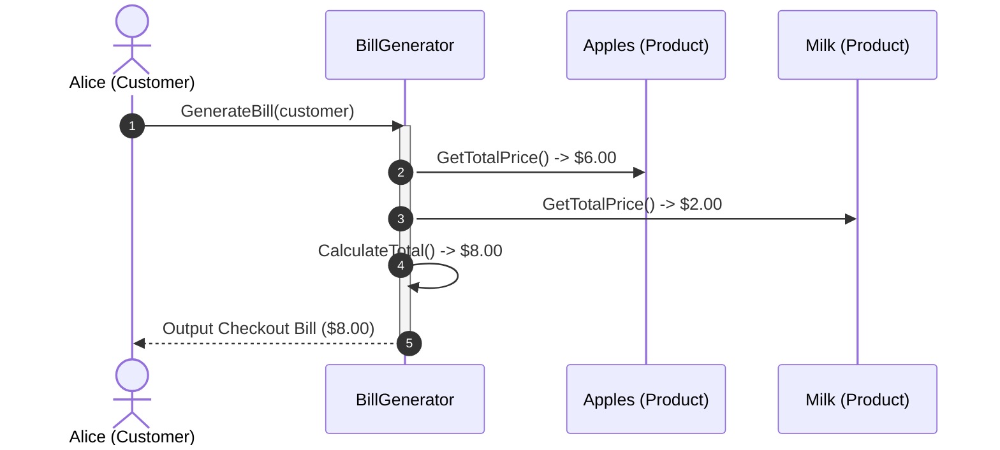

# Object Modeling Diagrams & Comparative Analysis

This document provides visual modeling diagrams (Class, Object, and Sequence diagrams) for the **School Results Application** and **Grocery Store Bill Generation Application**, highlighting the difference between **Aggregation** and **Composition**.

---

## 1. School Results Application (Aggregation)

### 📐 Class Diagram
In this scenario, a `StudentResult` has an **aggregation** relationship (`o--`) with `SchoolSubject`. The subject objects exist independently of any specific student. `GradeCalculator` interacts with `StudentResult` to compute results.

### 📦 Object Diagram
Represents the runtime instance state where student **John** is aggregated with two subjects: **Maths** (90) and **Science** (85).

### 🔄 Sequence Diagram
Shows the interaction flow when a student requests their grade report.

---

## 2. Grocery Store Bill Generation Application (Composition)

### 📐 Class Diagram
In this scenario, `GroceryCustomer` has a **composition** relationship (`*--`) with `GroceryProduct`. The purchased products are created specifically for the customer's transaction and cannot exist independently of the purchase context.

### 📦 Object Diagram
Represents the runtime instance state where customer **Alice** owns two purchased products: **Apples** (2 kg @ $3) and **Milk** (1 L @ $2).

### 🔄 Sequence Diagram
Shows the interaction flow when a customer checks out and the total bill is calculated.

---

## 📊 Comparison of Scenarios

| Feature | School Results Application | Grocery Store Bill Application |
| :--- | :--- | :--- |
| **Classes** | `StudentResult`, `SchoolSubject`, `GradeCalculator` | `GroceryCustomer`, `GroceryProduct`, `BillGenerator` |
| **Relationship Type** | **Aggregation** (`o--`) | **Composition** (`*--`) |
| **Lifecycle Dependency** | Subjects exist independently of students. | Products in cart are tied to the purchase transaction. |
| **Primary Functionality** | Calculate average marks and final grade | Compute total purchase cost and generate checkout bill |
| **Key Entities** | Students, Subjects, Grades | Customers, Products, Bills |
